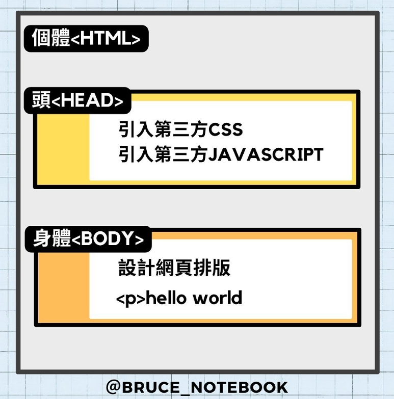

## 第一堂

- 介紹何謂網頁
- 網頁架構

    <details>
        <summary>圖片1</summary>
        
    </details>

- 怎麼編輯網頁
- 下載vscode

    <a href="https://code.visualstudio.com/">下載點</a>
- 在瀏覽器上面寫出hello word
- 基礎標籤 
    <details>
    <summary>標籤p</summary>

    ```html
    <p> hello word</p>
    ```
    </details>

    <details>
    <summary>標籤h</summary>

    ```html
    <h1> hello word</h1>
    ```
    </details>


    
- 對字體做調整 style 
    > 怎麼設定文字大小

    ```css
    style="font-size: 50px;"
    ```

    > 怎麼設定文字顏色

    ```css
    style="color:red;"
    ```
- url
    > 概念什麼

    > 絕對位置

        - 像是網址或是電腦內部的全部路徑名稱

    > 相對位置

    - "./"   編輯的html為中心的當下目錄

        <details>
        <summary>./</summary>

        ```sh
        project   
        │   README.md    
        │                                          
        └───folder1◂───────────────────────────────────────┐       
        │   │   index.html   <-----以要編輯的檔案基準的當下目錄
        │   │   file012.txt
        │   │
        │   └───資料夾1-2
        │       │   file111.txt
        │   
        └───資料夾2
            │   file021.txt

        ```
        - 以index.html為基礎,因此可以獲取file012.txt、資料夾1-2的內容
        </details>
    
    - "../"  編輯的html為中心的上一層目錄內容
        <details>
        <summary>../</summary>

        ```sh
        project  ◂────────────────────────────────────────────┐
        │   README.md                                         │
        │                                                     │
        └───folder1                                           │
        │   │   index.html   <-----以要編輯的檔案基準的上一個目錄
        │   │   file012.txt
        │   │
        │   └───資料夾1-2
        │       │   file111.txt
        │   
        └───資料夾2
            │   file021.txt

        ```
        - 以index.html為基礎,因此可以獲取project內所有的資料夾
        </details>
    
   


- 自我練習

    怎麼將一張圖片賦予超連結到第二個html頁面?

    >提示

    - 1.會有page1.html與page2.html的檔案  
    - 2.page1中的圖片可以被點擊,成功連結到page2.html頁面並看到page2.html的內容

