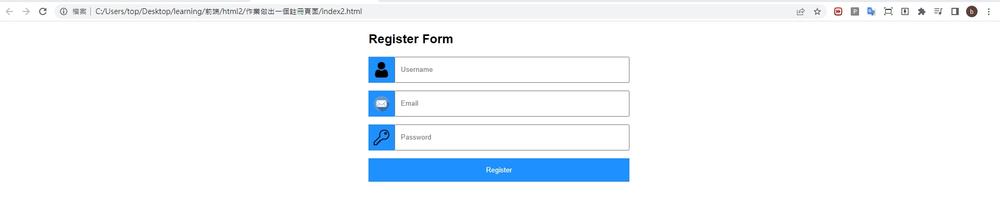

## 第二堂

- 標籤div
    > 將標籤群組化

    ```html
    <div></div>
    ```
- 標籤input
    > 表單空格的標籤

    ```html
    <input type="text" >
    <input type="password" placeholder="密碼">
    <input type="date">
    ```
- 標籤button
    > 按鈕的標籤

    ```html
    <button type="button">送出</button>
    ```
- css群組化
    ```css
    .自定義名稱{
        設定1:x;
        設定2:x;
    }
    .mystyle{
        color:red;
        background-color:black; 
    }
    ```

- css 置中

    > 文字置中
    ```css
    text-align:center      
    ```
    > 元素置中
    >> display: flex:影響子類並且並排
    ```css
    display: flex
    justify-content:center
    align-content:center
    ```
- css margin
    ```css
    margin:auto;          
    margin-bottom: 15px;
    margin-top: 15px;
    margin-left: 15px;
    margin-right: 15px;
    ```


- `自我練習`

    - <h3>作業1

    > 透過今天所教的元素,復刻出下方頁面

    > 展示畫面
    >> Username icon連結:https://cdn-icons-png.flaticon.com/512/1077/1077114.png
    >> Email icon連結:https://cdn-icons-png.flaticon.com/512/552/552486.png
    >> Password icon連結:https://cdn-icons-png.flaticon.com/512/807/807369.png

    > 設定
    ```css
    body {font-family: Arial, Helvetica, sans-serif;}
    * {box-sizing: border-box;}
    ```

    >> button padding大小為15px

    >> 小方框 padding大小為10px
    
    >> background-color: dodgerblue;


    
    
    *** 
    - <h3>作業2

        善用今天所教的內容,做一個簡單的畫面,自行發揮創意

        ex: 備忘錄,填寫表單,購物清單...


