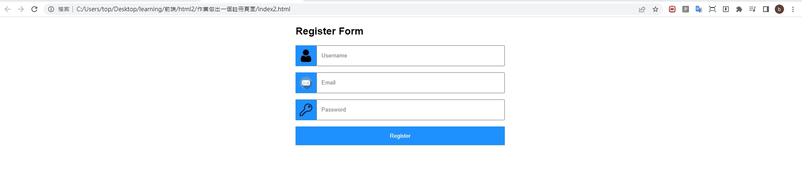

## 第三堂 Css-Display使用 & 簡易的發布網頁

- css 置中

    > 文字置中
    ```css
    text-align:center      
    ```
    > 元素置中
    >> display: flex:影響子類並且並排
    ```css
    display: flex
    justify-content:center
    align-content:center
    ```
- css margin
    單獨mergin的話,會自動的調整邊
    ```css
    margin:auto;          
    margin-bottom: 15px;
    margin-top: 15px;
    margin-left: 15px;
    margin-right: 15px;
    ```
- padding
    ```css
    padding:100px 20px;

    上下填充100px  左右填充20px
    ```


- 如何簡單的發布一個靜態網站
    google雲端版

    <a href="https://www.drv.tw/">google雲端發布網址</a>

    > 須將html公開

    > 圖片檔須轉為以下格式

    >>轉換方式
    >>> https://drive.google.com/file/d/`1JNjCPl7VVNLHWQ--8_-QAo-1pNcDfIxv`/view?usp=share_link

    >>> 轉換到下面格式

    >>>https://drive.google.com/uc?export=view&id=`1JNjCPl7VVNLHWQ--8_-QAo-1pNcDfIxv`
    
    


- `自我練習`
    二選一並發佈在goolge雲端上給其他人瀏覽

    - <h3>作業1

    > 透過今天所教的元素,復刻出下方頁面

    > 展示畫面
    >> Username icon連結:https://cdn-icons-png.flaticon.com/512/1077/1077114.png

    >> Email icon連結:https://cdn-icons-png.flaticon.com/512/552/552486.png
    
    >> Password icon連結:https://cdn-icons-png.flaticon.com/512/807/807369.png

    > 預設設定
    ```css
    <style>
    body {font-family: Arial, Helvetica, sans-serif;}
    * {box-sizing: border-box;}
    </style>
    ```
    > 本次作業會用到的元素
    ```
    margin-
    text-align
    background-color
    color
    padding
    width
    border: none;
    ```
    

    >> button padding大小為15px

    >> 小方框 padding大小為10px
    
    >> background-color: dodgerblue;


    
    
    *** 
    - <h3>作業2

        善用今天所教的內容,做一個簡單的畫面,自行發揮創意

        ex: 備忘錄,填寫表單,購物清單...


