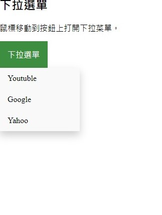

## 第四堂 Css-hover

## display的屬性介紹
- display: flex:
    影響子類並且並排
    ```css
    display: flex
    justify-content:center
    align-content:center
    ```

- display:inline
    向img標籤預設就是為inline,代表內容有多大,範圍就用多大
    ```css
    display:inline;
    ```

- display:block
    div標籤默認就是為block屬性,代表會換行
    ```css
    display:block;
    ```

- display:inline-block
    同時擁有block與inline的特性
    ```css
    display:inline-block;
    ```

## 偽元素

- css hover
    將css的群組名稱被滑入後會有其它的動作
    ```css
    a:hover { background: yellow; }
    ```
- css active
    將css的群組名稱被滑入後會有其它的動作
    ```css
    a:active { color: red; } 
    ```

- css link
    將css的群組名稱被滑入後會有其它的動作
    ```css
    a:link { color: blue; }   
    ```
- css visited
    將css的群組名稱被滑入後會有其它的動作
    ```css
    a:visited { color: purple; }
    ```

- css before
    ribbon之前的動作
    ```css
        .ribbon::before {
            content: "比原本還要早觸發的元素狀態";
            background-color: #dd2c2c;
        }
    ```

- css after
    ribbon之前的動作
    ```css
        .ribbon::after {
            content: "比原本還要晚觸發的元素狀態";
            background-color: #FFBA10;
        }
    ```

## 結合 
- 自定義設定與結合

    my-set-text為自定義設定
    ```html
    <span class="my-alert" my-set-text="我被跳出來提示" >提示</span>。
    ```

    css調用
    ```css
    .my-alert[my-set-text]{
        position: relative;
        text-decoration: underline;
        color: #00F;
        cursor: help;
    }

    .my-alert[my-set-text]:hover::after {
        content: attr(my-set-text);
        position: absolute;
        left: 0;
        top: 24px;
        min-width: 200px;
        border: 1px #aaaaaa solid;
        border-radius: 10px;
        background-color: #ffffcc;
        padding: 12px;
        color: #000000;
        font-size: 14px;
        z-index: 1;
    }
    ```

## 作業
- 作業圖

    

- 嘗試做出一個下拉式選單,並且連結到其他網頁

- 並思考看看如何把之前的作業結合完美化


