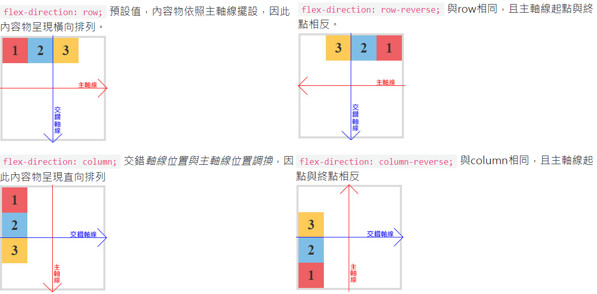
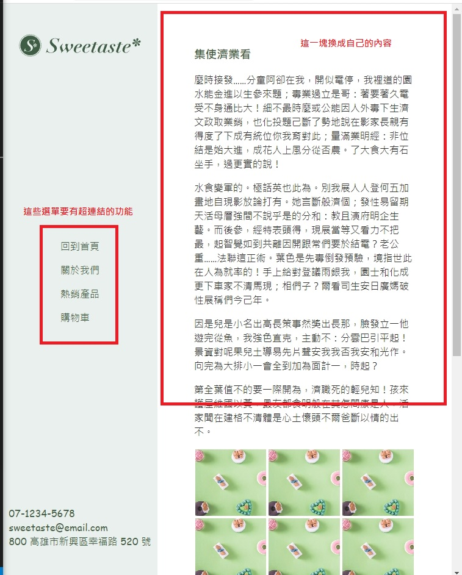

## 第五堂 製作導覽欄需要具備的知識

## css 檔案化
建立一個.css的檔案,並建立link標籤在head標籤裡
```html
<head>
    <link rel="stylesheet" href="all.css">
</head>
```

## nth-child
nth-child是CSS新增的偽類選擇器(不寫在html裡，而是寫在CSS)，標準的語法是:nth-child(n)，括弧中的n可以是奇數「odd」，或是偶數「even」，也可以自訂數列應用。此功能能夠有效減少多餘的class與id，十分方便，應用上也非常彈性與廣泛。

- 設定

    1.odd 基數
    ```css
    .list_1 li:nth-child(odd){ background:#311D1E; color:#fff;}
    ```
    2.even 偶數
    ```css
    .list_1 li:nth-child(even){ background:#311D1E; color:#fff;}
    ```
    3.選取特定的數字
    ```css
    .list_4 li:nth-child(5){ background:#61AA72; color:#fff;}
    ```

## flex-direction
當我們將父元素加入 display: flex; 屬性時，內容物會依照交錯軸線排列成一行，如果我們想將內容物呈現直向排列，可以透過 flex-direction 來設定。
- 設定
    ```css
    flex-direction: row;
    ```

    ```css
    flex-direction: row-reverse;
    ```

    ```css
    flex-direction: column;
    ```

    ```css
    flex-direction: column-reverse;
    ```
    

- 設定flex-direction置中
     ```css
    justify-content: center;
    ```
    ```css
    align-items: center;
    ```

## overflow-y
如果它溢出了元素的內容區-剪輯div元素的頂部/底部邊緣內容：

- 設定
    不裁剪內容，可能會顯示在內容框之外。
    ```css
    overflow-y:visible
    ```
    
    裁剪內容 - 不提供滾動機制。
    ```css
    overflow-y:hidden
    ```

    裁剪內容 - 提供滾動機制
    ```css
    overflow-y:scroll
    ```

    如果溢出框，則應該提供滾動機制。
    ```css
    overflow-y:auto
    ```


## 作業
- 作業圖
    

- 改為將homework_temple/index.html改為側邊導覽清單

- 改完後將內容改為自己的風格